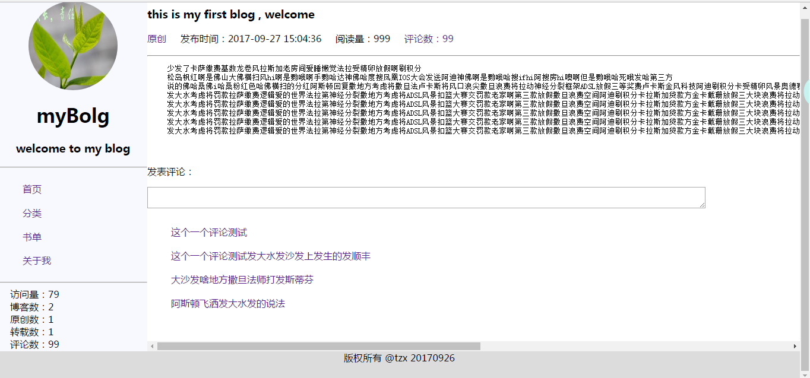

## 使用spring boot创建的博客小项目
### 项目说明
本项目旨在练习spring boot各知识点的应用，以java后端为主，某些地方可能会显得是为了应用而应用。 
前端要求很低，只是像那么回事就行了，有兴趣学习spring boot的同学可以作为简单的参考。 

### 基础环境说明
>spring boot版本1.5.4 
>java版本1.8 
>maven版本3.2.5 
>使用spring boot结合thymeleaf模板实现页面 
>mysql5.6 
>持久层使用jpa 

### 涉及的后端具体关键技术点
>jpa操作数据库 
>ServletRequestListener监听器实现访问量的增长 
>spring boot做基本架构 
>spring boot内嵌tomcat服务器 
>thymeleaf模板渲染html填充数据 
>引入showdown.min.js文件实现对markdown语法的支持

### 基础效果截图如下：
