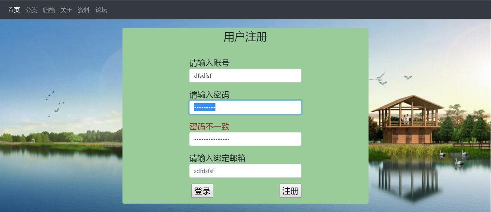

## 使用spring boot作为后台创建的博客小项目
### 项目说明
这是一个模拟的博客系统，旨在练习spring boot等知识点的应用，以java后端为主，某些地方可能会显得是为了应用而应用。 
前端技术在于简单练习和熟悉，参考价值可能不是太大。 
同时，本项目希望努力做成一个方便本地使用的文件管理系统，包含单不限于博客文章、pdf书籍阅读、资料管理等功能 
### github源代码地址
<https://github.com/tuzongxun/tzxblog>
### 基础环境和相关技术说明
>java 版本1.8  后台编程语言 
>spring boot 版本1.5.4  java后台主框架 
>maven 版本3.2.5  项目构建和依赖管理 
>使用spring boot结合thymeleaf模板    部分页面渲染 
>mysql5.6  数据持久化存储 
>jpa  持久层框架操作mysql 
>slf4j/logback  使用springboot默认日志框架记录操作日志 
>bootstrap4 页面美化 
>jquery3.2.1 动态操作html页面 
>markdown 部分页面渲染 
>html 部分页面渲染 
>css 页面样式控制 
>git 提交到github 

### 基础效果截图如下：

### 历程和进度（还在开发中）
**2017-9-26:** 基础页面布局，初次提交到github 

**2017-9-28:** 后台基础代码编写和数据库设计，并提交数据库结构sql到github 

**2017-9-29:** 前端页面增加对markdown语法的支持 

**2017-11-27:** 增加login页面，使用ajax请求，同时基础页面布局增加bootstrap支持 

**2017-11-28:** 优化登录功能，实现后台逻辑验证及验证后的前台提示 

**2017-11-28:** 增加注册功能，实现后台逻辑验证及前台可视化页面 

**2017-11-28:** 提取登录功能的js到独立文件中 
**2017-11-28:** java后台增加filter过滤器，对请求进行过滤 
**2017-11-28:** 根据登录与否动态决定"登录、注册、注销、用户"等信息的显示和隐藏 
**2017-11-28:** 增加简单的错误页面，使404、500等异常更加友好 

**2017-11-29:** 增加logback的配置，把日志记录到特定文件中，同时定义日志记录级别 
**2017-11-29:** 增加controller层的日志记录功能 
**2017-11-29:** 项目根路径增加gitattributes文件，使github改变默认显示的编程语言 
**2017-11-29:** 首页优化，由一篇示例博客改为博客列表 
**2017-11-29:** 首页优化，网站统计信息从静态模拟数据改为从数据库动态获取 

**2017-12-4:** 实现首页博客列表到打开具体博客的跳转 

**2018-1-29:** 实现评论时自动发送邮件功能（评论需登录） 

### 预计功能说明
1. 实现类似博客的文章访问功能，如文章标题、内容
1. 实现文章统计功能，如字数、时间、分类
1. 实现pdf书籍阅读功能
1. 实现资料上传和下载、资料列表功能
1. 实现基础的登录注册功能及权限控制
1. 根据不同用户权限展现不同页面内容
1. 实现推送功能
1. 实现评论邮件提醒功能
1. 日志记录